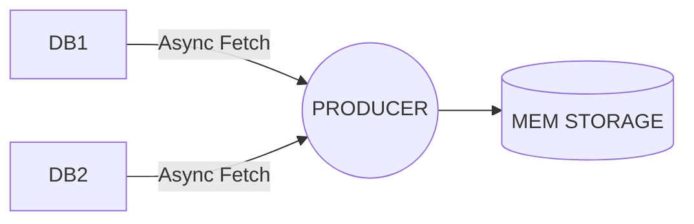
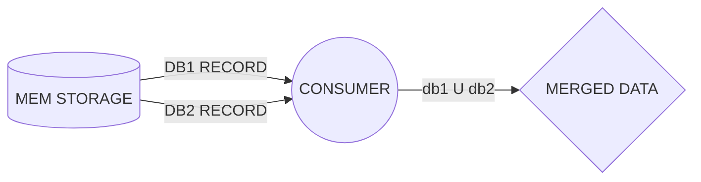
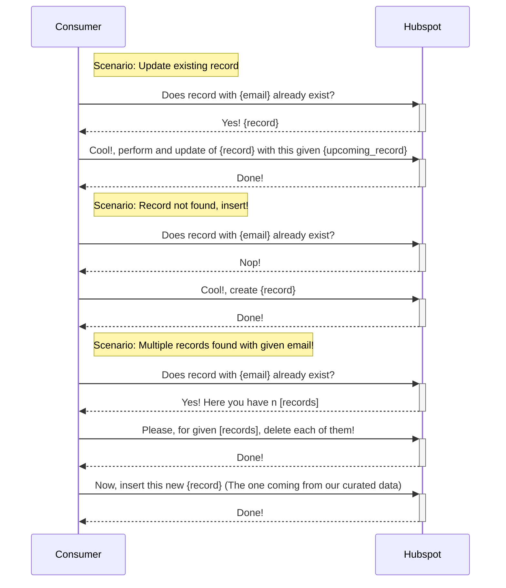

# Hubspot Middleware Sync

[This is the link to what we need to achieve](https://factorialco.notion.site/Customer-Tech-Engineer-1c04ba66228b4975b6428775683d6fc4)

## Disclaimer and some assumptions

I decided to create a small project as a POC. This is why in this project there is plain Ruby instead of a Rails project with DB connections or a Redis (This will be commented bellow).
Regarding the Hubspot integration it's been assumed that any registry in HS is by definition outdated, so when data is retrieve from DBs, deduplicated and filled as expected the action we want against HS is such an UPSERT, which means try to create it but if exists just replace that registry with the one coming from middleware (source of truth). 

In terms of tests/specs I did some of them not all posible combinations, just the necessary ones while programming.

## Actual solution

This middleware has a structure where each folder has its own responsibility. This is basically composed by a Producer (the one in charge of getting JSON data from files) and a Consumer (the one in charge of consuming and parsing this data before being sent to HS)

For this solution data is stored in a basic Structure, just in memory. Also the data is being retrieved by small chunks and stored in memory, just in case data became too big. Since data is consumed by chunks it's immediately stored and if anything has failed the ones already stored can be processed. (Planned to do this with Typhoeus but couldn't in the end, future feature)

The way of starting this up is by running the `init.rb`, just to keep simple. I would prepare a kind of Rake task that would easy to add a scheduler and perform this process automatically at certain points.

**Simple Schema:**

As mentioned before, I would go for a more consistent in memory storage such as Redis, the reason for memory and not a DB it self is that this is volatile information, we process the imported data and delete this cached information when all is done. Of course we would need store some of this data when something went wrong for some of the records, so we can retry n times before clearing up our cached data.

Also would help to implement a more independent consumer that allows us to start up as many consumer processes as data we have, for example consumers that go to queues and ask for more data to be processed un til done. This is also important because of any rate limit coming from HS, that needs some back-pressure system or a way to send those records to a dead queue to be retried later. 

## Files and folder

`/lib/errors`: Some custom errores 
`/lib/producers`: The producers in charge of retrieving and storing data. The intention here is to have any kind of way of producing this data, that's why producers need to implement the perform() method that's gonna be used to start up the process from a Rake task
`/lib/consumers`: The service in charge of consuming stored data and sending it to HS
`/lib/storage`: Where data is stored, just in memory

All your files and folders are presented as a tree in the file explorer. You can switch from one to another by clicking a file in the tree.

## How to use it

First of all ensure you have the Ruby version mentioned at `.ruby-version` file.
Then run `bundle install` in order to install all the dependencies.

In case the given db's url are not working they are located at `/config/config.yml` just replace the `db1` & `db2` urls as expected. This should be taken from env vars, but for this POC that's fine.

Run tests: `bundle exec rpsec`
To start up the process: `ruby init/init.rb`
The final result will be located at: `/output/hubspot_filtered_data.json`