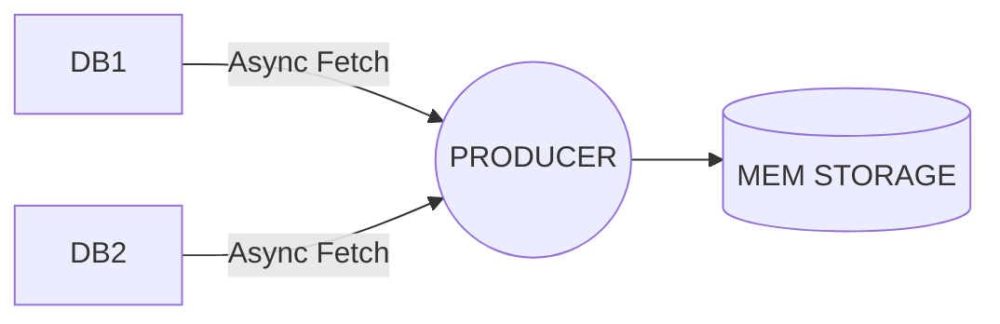
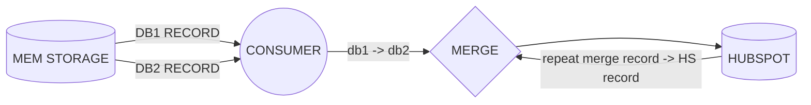

# Hubspot Middleware Sync

[This is the link to what we need to achieve](https://factorialco.notion.site/Customer-Tech-Engineer-1c04ba66228b4975b6428775683d6fc4)

## Disclaimer and some assumptions

I decided to create a small project as a POC. This is why in this project there is plain Ruby instead of a Rails project with DB connections or a Redis (This will be commented bellow).
Regarding the Hubspot integration it's been assumed that any registry in HS is by definition outdated, so when data is retrieve from DBs, deduplicated and filled as expected the action we want against HS is such an UPSERT, which means try to create it but if exists just replace that registry with the one coming from middleware (source of truth). 

## Actual solution

This middleware has a structure where each folder has its own responsibility. This is basically composed by a Producer (the one in charge of getting JSON data from files) and a Consumer (the one in charge of consuming and parsing this data before being sent to HS)

For this solution data is stored in a basic Structure, just in memory. Also the data is being retrieved by small chunks and stored in memory, just in case data became too big. Since data is consumed by chunks it's immediately stored and if anything has failed the ones already stored can be processed.

The way of starting this up is by running a Rake task, this task could be scheduled in a Crontab to get it running automatically at certain times.

Simple Schema:

## Files and folder

`/lib/errors`: Some custom errores 
`/lib/producers`: The producers in charge of retrieving and storing data. The intention here is to have any kind of way of producing this data, that's why producers need to implement the perform() method that's gonna be used to start up the process from a Rake task
`/lib/consumers`: The service in charge of consuming stored data and sending it to HS
`/lib/storage`: Where data is stored, just in memory

All your files and folders are presented as a tree in the file explorer. You can switch from one to another by clicking a file in the tree.

## How to use it

First of all ensure you have the Ruby version mentioned at `.ruby-version` file.
Then run `bundle install` in order to install all the dependencies.

As mentioned before it uses Rake to start this process up, so to check the task exist run `rake -T` and there should be a task named `hubspot:sync`.